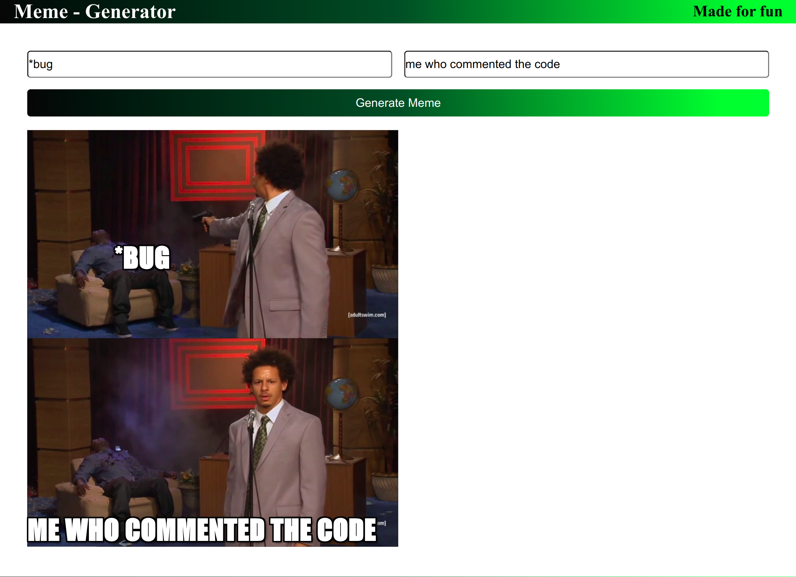

## Meme Generator 😆

A meme generator using react

meme images are taken from: https://api.imgflip.com/get_memes



## How to run locally

open the terminal/command prompt at the location where you want to setup the project.   

use the following commands in the terminal or command prompt:
```shell
git clone https://github.com/ContriHUB/Meme-Generator.git

cd Meme-Generator

npm i
```
once these command are completed successfully

do `npm start` to start the project


## Contributing
Pull requests are welcome. Read the [CONTRIBUTING](CONTRIBUTING.md) guide.
For major changes, please open an issue first to discuss what you would like to change.
add your name in the [CONTRIBUTORS.MD](CONTRIBUTORS.md) file

## NOTE: 
No external library is allowed for this project.


